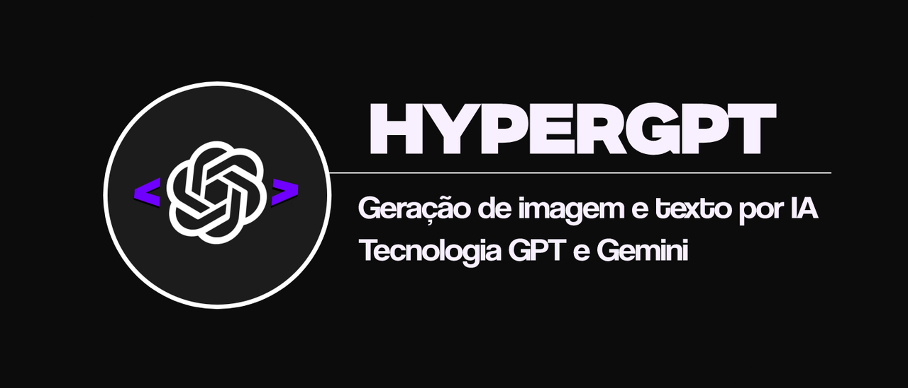
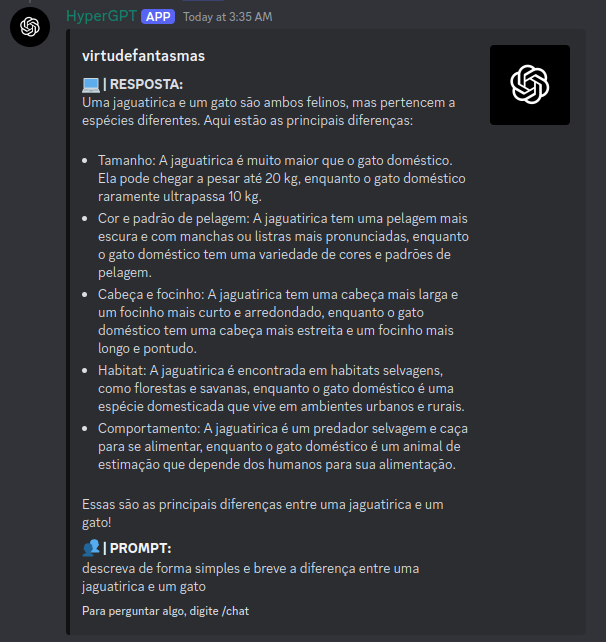

# HyperGPT

**Documentação de referência para usuários do BOT HyperGPT, desenvolvido com a tecnologia do ChatGPT.**

---

Esse BOT foi criado com foco em uso da inteligência artificial para criar interatividade e diversão para seu servidor!

As seguintes funcionialidades estão disponíveis:

- 🤖 - *Gerar respostas em texto com IA.*
- 🖼️ - *Gerar imagens com IA.*
- 🧠 - *O limite é sua imaginação.*

## Sumário

- [Configuração inicial](#configuração-inicial)
- [Keys](#keys)
  - [Comandos para gerenciar keys](#comandos-com-as-keys)
- [Comandos](#comandos-principais)
- [Como adquirir esse BOT?](#como-adquirir)
- [Contato](#contato)

## Configuração inicial

Requisitos:

- Uma *key* para ativar o bot.
- O *link* de convite para o bot.

Se você tem todos esses requisitos, por favor siga os seguintes passos **na ordem:**

1.  **Convide o BOT para seu servidor usando o link de convite.**
2.  **Use o comando `/activate` junto com sua key para ativar o BOT. Se você digitou corretamente, o BOT alertará que a key foi ativada com sucesso.**
> Exemplo: `/activate "7Z8V-LIFO-2W5T"`
3.  **Em caso de dúvidas, por favor leia mais informações sobre as keys na seção [abaixo](#keys).**
4.  **Use o comando `/expires` para checar quando sua key vai expirar. Esse comando pode ser usado a qualquer momento para te deixar informado.**
5.  **Pronto! O BOT já está configurado e pode ser usado. Confira todos os comandos disponíveis na seção [comandos](#comandos-principais).**

## Keys

> [!IMPORTANT]
> Keys são usadas para a ativação da aplicação. Confira a seguir informações essenciais sobre as keys:

- Você deve usar apenas uma key e **uma vez** por mês. Se você tem 2 ou mais keys, aguarde até 1 dia antes da data de expiração da key para usar uma nova. Se você usar uma key e em seguida usar outra, isso não extenderá o prazo de expiração.
- Uma key funciona só uma vez. Se você tentar usar uma key usada, você vai receber uma mensagem alertando que a key não pôde ser usada para ativar o BOT.
- Nenhum comando ou interação com o bot será possível se o BOT não estiver ativado com a key.

### Comandos com as keys

---

#### ⚙️ /activate - `key` 
Ativa o bot com uma key.

- `key` - A key que deve ser usada para que o bot seja ativado.

> Exemplo: `/activate "7Z8V-LIFO-2W5T"`

---

#### ⚙️ /expires 
Checa a data de expiração da key.

Esse comando não tem parâmetros.

---

## Comandos principais

#### ⚙️ /chat - `prompt` 
Converse com a IA.

- `prompt` - Pode ser qualquer mensagem de texto, incluindo perguntas ou afirmações.

> Exemplo: Uma pergunta aleatória de matemática.

`/chat "descreva de forma simples e breve a diferença entre uma jaguatirica e um gato"`

---

#### ⚙️ /imagine - `model`, `prompt`, `width`, `height`
Gera uma imagem baseada no prompt usando IA.

- `model` - Modelo para usar. Pode ser *prodia* ou *pollinations*.
- `prompt` - Prompt que será usado para gerar a imagem.
- `width` - Largura da imagem a ser gerada. **(SÓ FUNCIONA COM POLLINATIONS)**
- `height` - Altura da imagem a ser gerada. **(SÓ FUNCIONA COM POLLINATIONS)**

> Exemplo: Gerando uma imagem de uma elfa de cabelo verde na cidade. 

*Detalhe: o prompt não precisa estar em inglês, mas prompts em inglês geram imagens mais detalhadas.*

`/imagine "prodia" "green haired elf in the city"`

`/imagine "pollinations" "mermaid" "1280" "720"`

---

## Como adquirir

**Você pode adquirir este BOT oficialmente no nosso [canal oficial do Discord.](https://discord.gg/M7FURN5R88)**

## Contato

**Esse BOT foi desenvolvido com carinho por Miguel, desenvolvedor full stack.**

Todos os links de contato estão abaixo.

- **Email: miguelup01@outlook.com**
- **Servidor: [HyperStore](https://discord.gg/M7FURN5R88)**
- **Discord: miguelnto**
